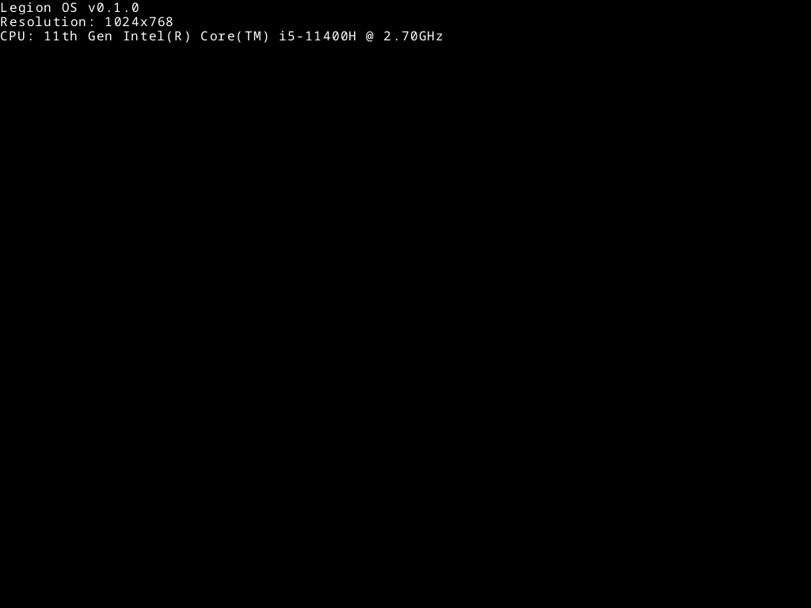

# Legion OS

Small operating system written in Rust (In development). Currently can print text using Noto Sans Font and boots using UEFI.



# Build

Use cargo to build kernel file:

```shell
cargo build --release
```

Compiled kernel file is at `target/x86_64-legion-os/release/legion_os`

# Usage

Build and setup [bootloader](https://github.com/soroushalinia/legion_loader).

Copy `legion_os` file at root directory of boot partition. If file name is different, bootloader won't recognize kernel.
